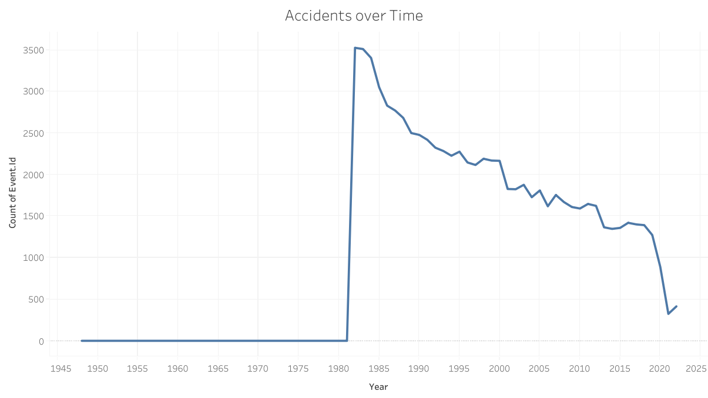
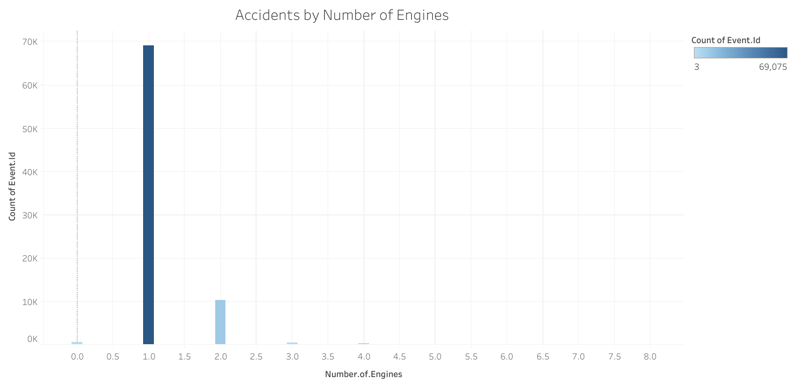
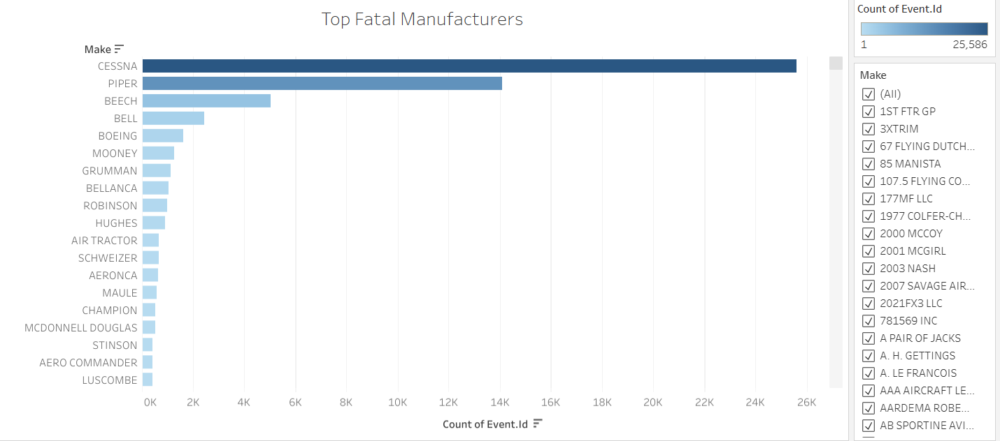

# Aviation Safety Analysis: Identifying Low-Risk Aircraft

## Overview
This project analyzes aviation accident data (1962–2023) from the National Transportation Safety Board (NTSB) to identify low-risk aircraft types and provide recommendations for a company entering the aviation industry.

## Business Understanding
The company is expanding into the aviation sector but lacks knowledge of risks across different aircraft types.  
**Key business questions:**
- Which aircraft are most accident-prone?
- Are multi-engine planes safer than single-engine planes?
- Which manufacturers and models carry the highest risks?

## Data Understanding and Analysis
- **Source:** NTSB Aviation Accident Database (1962–2023)  
- **Key Features:** Event Date, Location, Country, Make, Model, Engine Type, Number of Engines, Injury Severity, Fatalities.  
- **Data Cleaning:** Missing values handled, injury severity simplified, year extracted for trend analysis.  

### Key Visualizations
1. **Accidents Over Time**  
   Aviation accidents have declined significantly since the 1980s.  
     

2. **Accidents by Number of Engines**  
   Single-engine aircraft dominate accident counts, while multi-engine planes are safer.  
     

3. **Accidents by Manufacturer**  
   Cessna, Piper, and Beech appear most frequently, reflecting widespread use rather than poor design.  
     

## Conclusion
- Aviation accidents have declined significantly since the 1980s due to stronger regulations and better technology.  
- Single-engine aircraft are the most accident-prone, while multi-engine aircraft demonstrate greater safety.  
- High accident counts for manufacturers like Cessna and Piper reflect fleet size and usage, not poor design.  

### Recommendations
1. Prioritize investment in **multi-engine aircraft** for safety.  
2. Select **modern models** with strong post-2000 safety records.  
3. Avoid **high-fatality models** during the initial expansion phase.  

---

## Interactive Dashboard
👉 Explore the full interactive dashboard here: https://public.tableau.com/shared/4KH8JKDG5?:display_count=n&:origin=viz_share_link

OR 

https://public.tableau.com/views/AviationSafetyDashboard19622023/AviationSafetyDashboard?:language=en-GB&:sid=&:redirect=auth&:display_count=n&:origin=viz_share_link
